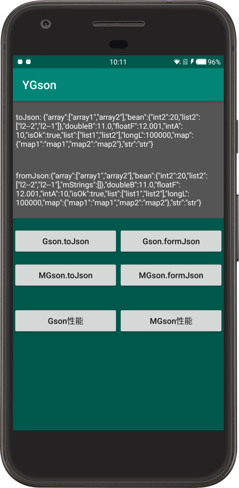

### Gson++

后台开发和前端开发往往使用不通语言，导致约定的Json数据在线上经常出现脏数据，要么APP直接崩溃要么界面展示异常。如何完美监控和进行脏数据容错处理呢？

#### Gson

google 提供了优秀的json解析库Gson，一般通过自定义TypeAdapter可以实现基础数据类型兜底，但是集合、数组、对象这些复杂类型如何兜底比较难；

#### 原理

JsonReader消费掉用无法解析的类型对用的json,即可跳过这个字段,向后面继续解析。

跳过的字段通过赋值默认值即可兜底

Number      0
Boolean     false
Collection  new Collection()
String      ""

#### 效果

```json
{
    "array":["array1","array2"],
    "bean":
    {
        //此处缺失 mString
        "int2":20,
        "list2":["l2--2","l2--1"]
    },
    "doubleB":11.0,
    "floatF":12.001,
    "intA":10,
    "isOk":true,
    "list":["list1","list2"],
    "longL":100000,
    "map":{"map1":"map1","map2":"map2"},
    "str":"str"
}
```




#### 支持

对以下类型可以强支持常见数据给错或不给都可以容错

数字`Number:int\Integer，double\Double,float\Float,long\Long,short\Short`

逻辑 `Boolean:boolean\Boolean`集合`Array：array,Collection` 字符`string:String`

对象`Object 这个比较特殊，没有给出对应字段不能帮助兜底，会循环卡死，例如自己包含自己 自己内部字段引用包含自己等`

```java
class Test{
  int i;
  String str;
  Test demo; //不支持此种 为了防止问题
  boolean isOk;//支持数字json 解析器完成转换（1 true 非1 false）
  //用法：api定义了 0,1 做开关 {isOk:1}，我们不用 int 直接用 boolean 
}
```


#### 监控上报

```java
JsonErrorHandler.setListener(new JsonSyntaxErrorListener() {
	@Override
    public void onJsonSyntaxError(String exception, String invokeStack) {
        	// 上报     日志中包含错误和原json数据便于直接定位错误
            Log.e("json", "syntax exception: " + exception);
            Log.e("json", "stack exception: " + invokeStack);
    }
});
```

#### 性能

解析和序列化分别循环1500次

| 用法           | 解析  | 序列化 |
| ------------- | ----- | ------ |
| `new Gson()`  | 100ms | 110ms  |
| `GsonUtils.getGson()` | 103ms | 120ms  |


 * {@link JsonReader}提供了方法  {@link JsonReader#skipValue()}
 * 通过读取跳过字段,没有进行解析性能高于 {@link JsonReader#nextDouble()} 、{@link JsonReader#nextString()}  、{@link JsonReader#nextName()}


普通数据性能差距并不大，但是一旦出现`JSON`没有定义字段，兜底机制需要反射获取这些字段耗费极大性能

详情测试修改常规支持字段为其他类型，测试性能。大约是普通的8倍。

另外如果关闭监控性能几乎和原生一致

#### 作者

:man: 岛主                                 	:e-mail:  fojrking@sina.com

